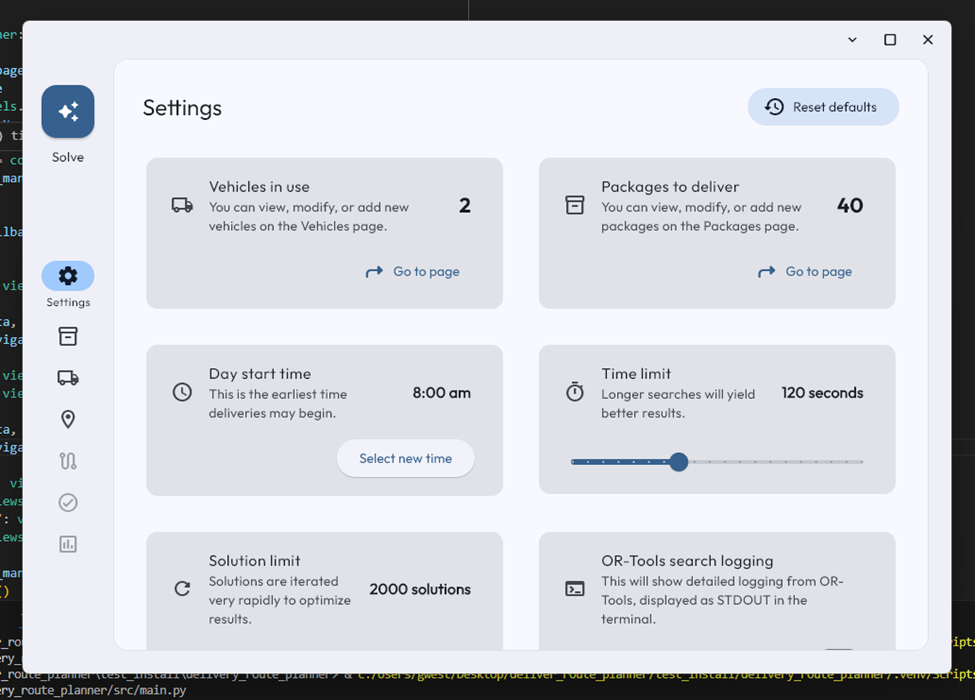
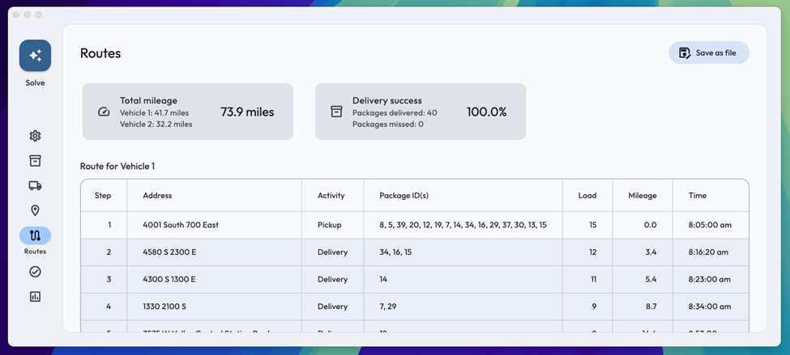
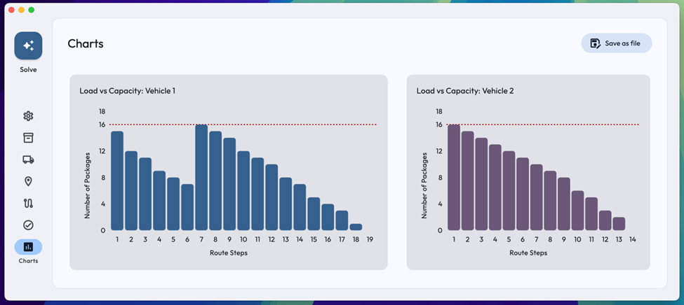

# Delivery Route Planner

A desktop application that solves complex Vehicle Routing Problems (VRP) using advanced metaheuristic searching algorithms. This application optimizes delivery routes while handling multiple real-world constraints such as vehicle capacities, delivery deadlines, package availability times, and special delivery requirements.

## Features

The application provides an intuitive graphical interface for managing delivery routes with the following capabilities:

- Metaheuristic search algorithms for route optimization
- Support for multiple vehicles with customizable specifications
- Multiple constraint handling:
  - Vehicle capacity limits
  - Package delivery deadlines
  - Package availability delays
  - Vehicle-specific delivery requirements
  - Linked package groups requiring same-vehicle delivery
- Real-time solution visualization with interactive charts
- Comprehensive route validation and constraint verification
- Configurable solver settings for optimization control



## Technology Stack

- Python 3.12.7
- Google OR-Tools for route optimization algorithms
- Flet/Flutter for the graphical user interface
- CSV-based data management

## Installation

1. Install Python 3.12.7 from the [official Python downloads page](https://www.python.org/downloads/release/python-3127/)

2. Install Visual C++ Redistributable if not already present:
   [Microsoft Visual C++ Redistributable](https://www.microsoft.com/en-US/download/details.aspx?id=48145)

3. Clone the repository and navigate to the project directory:
   ```bash
   git clone [repository-url]
   cd delivery_route_planner
   ```

4. Create and activate a virtual environment:
   ```bash
   py -3.12 -m venv venv
   venv\Scripts\activate
   ```

5. Install dependencies:
   ```bash
   pip install -r requirements.txt
   ```

6. Launch the application:
   ```bash
   python src/main.py
   ```

## Usage

The application provides several interfaces for managing delivery routes:

### Settings
- Configure solver parameters including:
  - Start time for deliveries
  - Time limit for solution search
  - Solution iteration limit
  - Algorithm selection (First Solution Strategy and Local Search Metaheuristic)
  - Diagnostic logging options

### Vehicle Management
- Add, modify, or remove delivery vehicles
- Customize vehicle specifications:
  - Maximum package capacity
  - Average speed
- Reset to default configuration as needed

### Route Planning
- View complete routing solutions with:
  - Package pickup and delivery sequences
  - Timing details for each stop
  - Distance calculations between locations
  - Total mileage optimization results

  

### Validation
- Verify constraint satisfaction:
  - Delivery deadline compliance
  - Package availability timing
  - Vehicle-specific requirements
  - Linked package groupings
- Review solution completeness and efficiency

### Data Visualization
- Interactive charts showing:
  - Vehicle utilization distribution
  - Package load progression
  - Mileage accumulation over time
  - Comparative vehicle statistics

  

## Performance

The application consistently achieves efficient routing solutions:
- Typical solution time: 60-120 seconds
- Average total mileage: < 80 miles (for the sample dataset)
- 100% constraint satisfaction when solutions are possible
- Graceful handling of impossible constraints with clear user feedback

## Data Management

The application uses two primary CSV files for data input:
- `package_details.csv`: Contains package information and delivery requirements
- `distance_matrix.csv`: Contains location data and inter-location distances

The current implementation requires maintaining the established CSV format for data compatibility, and was designed to be used only with the current example dataset for the initial scope of this project.

## Implementation Notes

The project implements several features for handling Vehicle Routing Problems:
- Multiple VRP variants handled simultaneously:
  - Capacitated VRP
  - VRP with Time Windows
  - VRP with Pickup and Delivery
  - VRP with Multiple Trips
- Custom node abstraction for package management
- Penalty-based constraint optimization
- Dynamic route planning with vehicle reloading
